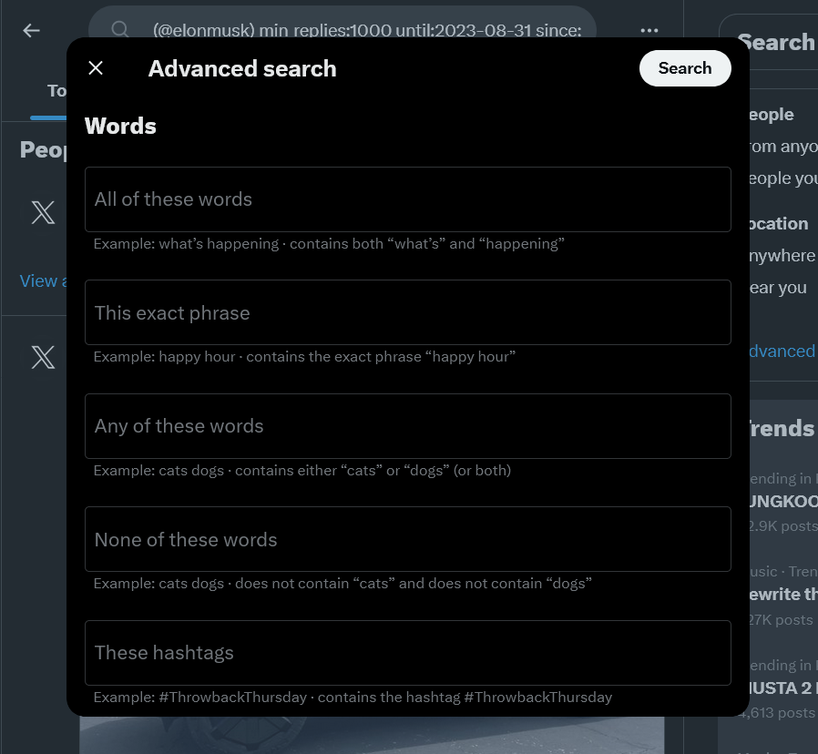

# selenium-twitter-scraper

## Setup

1. Install dependencies

```bash
pip install -r requirements.txt
```

## Authentication Options

### Using Environment Variable

1. Rename `.env.example` to `.env`.

2. Open `.env` and update environment variables

```bash
TWITTER_USERNAME=# Your Twitter Handle (e.g. @username)
TWITTER_USERNAME=# Your Twitter Username
TWITTER_PASSWORD=# Your Twitter Password
```

### Authentication in Terminal

- Add a `username` and `password` to the command line.

```bash
python scraper --user=@elonmusk --password=password123
```

### No Authentication Provided

- If you didn't specify a username and password, the program will
  ask you to enter a username and password.

```bash
Twitter Username: @username
Password: password123
```

---

**_Authentication Sequence Priority_**

```bash
1. Authentication provided in terminal.
2. Authentication provided in environment variables.
```

---

## Usage

- Show Help

```bash
python scraper --help
```

- Basic usage

```bash
python scraper
```

- Setting maximum number of tweets. defaults to `50`.

```bash
python scraper --tweets=500   # Scrape 500 Tweets
```

- Options and Arguments

```bash
usage: python scraper [option] ... [arg] ...

authentication options  description
--user                  : Your twitter account Handle.
                          e.g.
                          --user=@username

--password              : Your twitter account password.
                          e.g.
                          --password=password123

options:                description
-t, --tweets            : Number of tweets to scrape (default: 50).
                          e.g.
                            -t 500
                            --tweets=500

-u, --username          : Twitter username.
                          Scrape tweets from a user's profile.
                          e.g.
                            -u elonmusk
                            --username=@elonmusk

-ht, --hashtag          : Twitter hashtag.
                          Scrape tweets from a hashtag.
                          e.g.
                            -ht javascript
                            --hashtag=javascript

-q, --query             : Twitter query or search.
                          Scrape tweets from a query or search.
                          e.g.
                            -q "Philippine Marites"
                            --query="Jak Roberto anti selos"

-a, --add               : Additional data to scrape and
                          save in the .csv file.

                          values:
                          pd - poster's followers and following

                          e.g.
                            -a "pd"
                            --add="pd"

                          NOTE: Values must be separated by commas.

--latest                : Twitter latest tweets (default: True).
                          Note: Only for hashtag-based
                          and query-based scraping.
                          usage:
                            python scraper -t 500 -ht=python --latest

--top                   : Twitter top tweets (default: False).
                          Note: Only for hashtag-based
                          and query-based scraping.
                          usage:
                            python scraper -t 500 -ht=python --top

-ntl, --no_tweets_limit : Set no limit to the number of tweets to scrape
                          (will scrap until no more tweets are available).
```

### Sample Scraping Commands

- **Custom Limit Scraping**

```bash
python scraper -t 500
```

- **User Profile Scraping**

```bash
python scraper -t 100 -u elonmusk
```

- **Hashtag Scraping**

  - Latest

    ```bash
    python scraper -t 100 -ht python --latest
    ```

  - Top

    ```bash
    python scraper -t 100 -ht python --top
    ```

- **Query or Search Scraping**
  _(Also works with twitter's advanced search.)_

  - Latest

    ```bash
    python scraper -t 100 -q "Jak Roberto Anti Selos" --latest
    ```

  - Top

    ```bash
    python scraper -t 100 -q "International News" --top
    ```

- **Advanced Search Scraping**

  - For tweets mentioning `@elonmusk`:

    ```bash
    python scraper --query="(@elonmusk)"
    ```

  - For tweets that mentions `@elonmusk` with at least `1000` replies from `January 01, 2020 - August 31, 2023`:

    ```bash
    python scraper --query="(@elonmusk) min_replies:1000 until:2023-08-31 since:2020-01-01"
    ```

  - Perform more `Advanced Search` using Twitter's Advanced Search, just setup the advanced query and copy the resulting string query to the program:
  - **[Twitter Advanced Search](https://twitter.com/search-advanced)**
    [](./img/advanced-search-01.png)

- **Scrape Additional Data**

```bash
python scraper --add="pd"
```

| Values | Description                                        |
| :----: | :------------------------------------------------- |
|   pd   | Tweet poster's id, followers, and following count. |

---
# Selenium Twitter Scraper

A powerful Python-based web scraper for Twitter data collection using Selenium WebDriver. This tool allows you to extract tweets, user information, hashtags, and engagement metrics from Twitter without using the official API.

## Features

- **Tweet Scraping**: Extract tweets based on keywords, hashtags, or user profiles
- **User Analytics**: Collect user information including followers, following, and verification status
- **Hashtag Analysis**: Track hashtag performance and trends
- **Engagement Metrics**: Gather likes, retweets, replies, and other engagement data
- **Data Export**: Save scraped data in multiple formats (CSV, JSON, Excel)
- **Customizable Filters**: Filter by date range, tweet type, and user verification status
- **Headless Mode**: Run scraper in background without opening browser window
- **Rate Limiting**: Built-in delays to respect Twitter's rate limits
- **Error Handling**: Robust error handling and retry mechanisms

## Prerequisites

Before running this project, make sure you have the following installed:

- **Python 3.8+** (recommended Python 3.9 or higher)
- **Google Chrome** browser
- **ChromeDriver** (will be managed automatically by the script)
- **Git** (for cloning the repository)

## Installation

### 1. Clone the Repository

```bash
git clone git@github.com:Jelius47/Selenium_for_twitter.git
cd Selenium_for_twitter
```

### 2. Create Virtual Environment

```bash
# Create virtual environment
python -m venv venv

# Activate virtual environment
# On Windows:
venv\Scripts\activate

# On macOS/Linux:
source venv/bin/activate
```

### 3. Install Dependencies

```bash
pip install -r requirements.txt
```

If `requirements.txt` doesn't exist, install the core dependencies:

```bash
pip install selenium pandas beautifulsoup4 webdriver-manager python-dotenv openpyxl
```

### 4. Environment Configuration

Create a `.env` file in the project root:

```env
# Browser Settings
HEADLESS_MODE=True
IMPLICIT_WAIT=10
PAGE_LOAD_TIMEOUT=30

# Scraping Settings
DEFAULT_DELAY=2
MAX_RETRIES=3
RESULTS_PER_PAGE=20

# Output Settings
OUTPUT_FORMAT=csv
OUTPUT_DIRECTORY=./data/
```

## Quick Start

### Basic Usage

```python
from selenium_twitter_scraper import TwitterScraper

# Initialize scraper
scraper = TwitterScraper(headless=True)

# Scrape tweets by keyword
tweets = scraper.scrape_tweets(
    query="python programming",
    max_tweets=100,
    date_range="7d"
)

# Save results
scraper.save_to_csv(tweets, "python_tweets.csv")
```

### Command Line Usage

```bash
# Scrape tweets by keyword
python scraper.py --query "artificial intelligence" --max-tweets 500 --output tweets.csv

# Scrape user profile
python scraper.py --user "elonmusk" --include-replies --output elon_tweets.json

# Scrape hashtag
python scraper.py --hashtag "MachineLearning" --days 30 --format excel
```

## Project Structure

```
Selenium_for_twitter/
├── src/
│   ├── __init__.py
│   ├── scraper.py              # Main scraper class
│   ├── tweet_parser.py         # Tweet data parsing
│   ├── user_parser.py          # User data parsing
│   └── utils.py               # Helper functions
├── data/
│   ├── raw/                   # Raw scraped data
│   ├── processed/             # Cleaned data
│   └── exports/               # Final output files
├── config/
│   ├── settings.py            # Configuration settings
│   └── selectors.py           # CSS/XPath selectors
├── tests/
│   ├── test_scraper.py
│   └── test_parsers.py
├── examples/
│   ├── basic_scraping.py
│   ├── advanced_filtering.py
│   └── batch_processing.py
├── requirements.txt
├── .env.example
├── .gitignore
└── README.md
```

## Configuration Options

### Scraper Settings

```python
scraper = TwitterScraper(
    headless=True,              # Run in headless mode
    implicit_wait=10,           # Wait time for elements
    page_load_timeout=30,       # Page load timeout
    proxy=None,                 # Proxy settings (optional)
    user_agent=None            # Custom user agent (optional)
)
```

### Search Parameters

```python
tweets = scraper.scrape_tweets(
    query="search term",        # Search query
    max_tweets=100,            # Maximum tweets to scrape
    date_range="7d",           # Date range (1d, 7d, 30d, 90d)
    tweet_type="all",          # Tweet type (all, original, replies)
    verified_only=False,       # Only verified users
    include_retweets=True,     # Include retweets
    lang="en"                  # Language filter
)
```

## Data Output Formats

### CSV Output
```csv
tweet_id,username,handle,tweet_text,timestamp,likes,retweets,replies,verified
1234567890,John Doe,@johndoe,Hello world!,2025-06-11 10:30:00,42,15,8,True
```

### JSON Output
```json
{
  "tweet_id": "1234567890",
  "username": "John Doe",
  "handle": "@johndoe",
  "tweet_text": "Hello world!",
  "timestamp": "2025-06-11T10:30:00Z",
  "engagement": {
    "likes": 42,
    "retweets": 15,
    "replies": 8
  },
  "user_verified": true
}
```

## Advanced Examples

### 1. Scrape Multiple Keywords

```python
keywords = ["AI", "machine learning", "deep learning"]
all_tweets = []

for keyword in keywords:
    tweets = scraper.scrape_tweets(query=keyword, max_tweets=200)
    all_tweets.extend(tweets)

scraper.save_to_csv(all_tweets, "ai_related_tweets.csv")
```

### 2. Monitor Trending Hashtags

```python
# Get trending hashtags
trending = scraper.get_trending_hashtags(location="worldwide")

# Scrape tweets for each trending hashtag
for hashtag in trending[:5]:  # Top 5 trending
    tweets = scraper.scrape_tweets(query=f"#{hashtag}", max_tweets=50)
    scraper.save_to_csv(tweets, f"{hashtag}_tweets.csv")
```

### 3. User Analysis

```python
# Scrape user profile and recent tweets
user_data = scraper.scrape_user_profile("username")
user_tweets = scraper.scrape_user_tweets("username", max_tweets=100)

# Analyze engagement patterns
engagement_analysis = scraper.analyze_engagement(user_tweets)
```

## Rate Limiting & Best Practices

### Rate Limiting
- Built-in delays between requests (configurable)
- Automatic retry mechanism for failed requests
- Respect Twitter's rate limits to avoid blocking

### Best Practices
```python
# Use appropriate delays
scraper.set_delay(min_delay=2, max_delay=5)

# Implement error handling
try:
    tweets = scraper.scrape_tweets(query="example")
except ScrapingError as e:
    print(f"Scraping failed: {e}")

# Save progress periodically
scraper.enable_checkpoint_saving(interval=100)
```

## Troubleshooting

### Common Issues

**1. ChromeDriver Issues**
```bash
# Update ChromeDriver
pip install --upgrade webdriver-manager
```

**2. Element Not Found**
- Check if Twitter has updated their HTML structure
- Update selectors in `config/selectors.py`

**3. Rate Limiting**
- Increase delays between requests
- Use proxy rotation (if available)
- Implement longer breaks between batches

**4. Memory Issues**
- Process data in smaller batches
- Clear browser cache periodically
- Use generator functions for large datasets

### Debug Mode

```python
# Enable debug logging
import logging
logging.basicConfig(level=logging.DEBUG)

scraper = TwitterScraper(debug=True)
```

## Performance Optimization

### Speed Improvements
```python
# Disable image loading
scraper.disable_images()

# Use headless mode
scraper = TwitterScraper(headless=True)

# Optimize selectors
scraper.use_optimized_selectors()
```

### Memory Management
```python
# Process in batches
for batch in scraper.scrape_in_batches(query="example", batch_size=100):
    process_batch(batch)
    scraper.clear_cache()
```

## Contributing

1. Fork the repository
2. Create a feature branch (`git checkout -b feature/amazing-feature`)
3. Commit your changes (`git commit -m 'Add amazing feature'`)
4. Push to the branch (`git push origin feature/amazing-feature`)
5. Open a Pull Request

## License

This project is licensed under the MIT License - see the [LICENSE](LICENSE) file for details.

## Legal Disclaimer

This tool is for educational and research purposes only. Please ensure you comply with:
- Twitter's Terms of Service
- Applicable laws and regulations
- Respect for user privacy and data protection

The developers are not responsible for any misuse of this tool.

## Support

If you encounter any issues or have questions:

1. Check the [Issues](https://github.com/Jelius47/Selenium_for_twitter/issues) page
2. Create a new issue with detailed description
3. Include error logs and system information

## Acknowledgments

- Selenium WebDriver team
- Python community
- Contributors and testers

---

**If this project helped you, please consider giving it a star!**